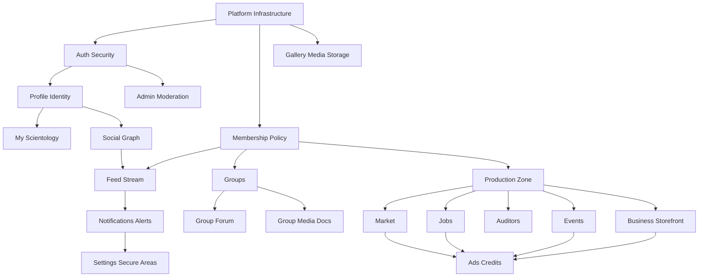

# System Map

Theta-Space is a private, invite-based modular monolith.

```mermaid
flowchart TD
  Platform[Platform Infrastructure] --> Auth[Auth Security]
  Platform --> Policy[Membership Policy]
  Platform --> Media[Gallery Media Storage]
  Auth --> Profile[Profile Identity]
  Policy --> Feed[Feed Stream]
  Policy --> Groups[Groups]
  Policy --> Production[Production Zone]
  Profile --> Scientology[My Scientology]
  Profile --> Social[Social Graph]
  Social --> Feed
  Feed --> Notifications[Notifications Alerts]
  Groups --> GroupForum[Group Forum]
  Groups --> GroupMedia[Group Media Docs]
  Production --> Market[Market]
  Production --> Jobs[Jobs]
  Production --> Auditors[Auditors]
  Production --> Events[Events]
  Production --> Business[Business Storefront]
  Business --> Ads[Ads Credits]
  Market --> Ads
  Jobs --> Ads
  Events --> Ads
  Auth --> Admin[Admin Moderation]
  Notifications --> Settings[Settings Secure Areas]
```

Core rule: pages render surfaces, modules own behavior, Prisma is accessed through server/domain logic.

